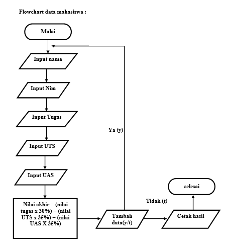
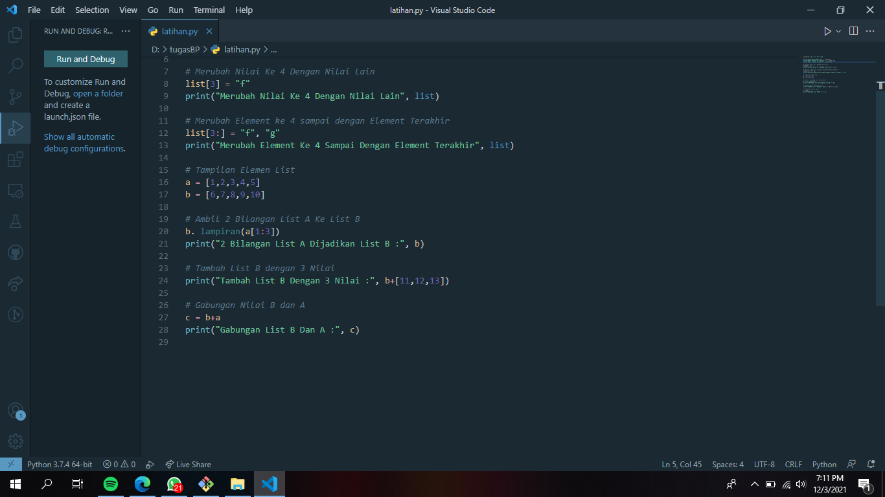
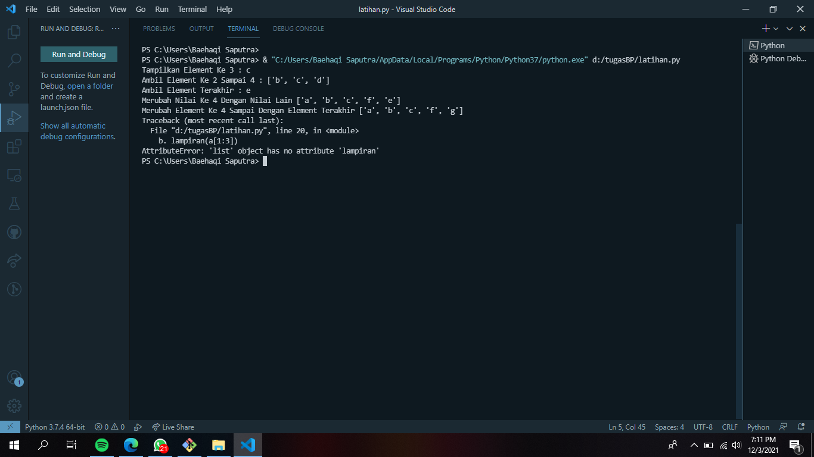
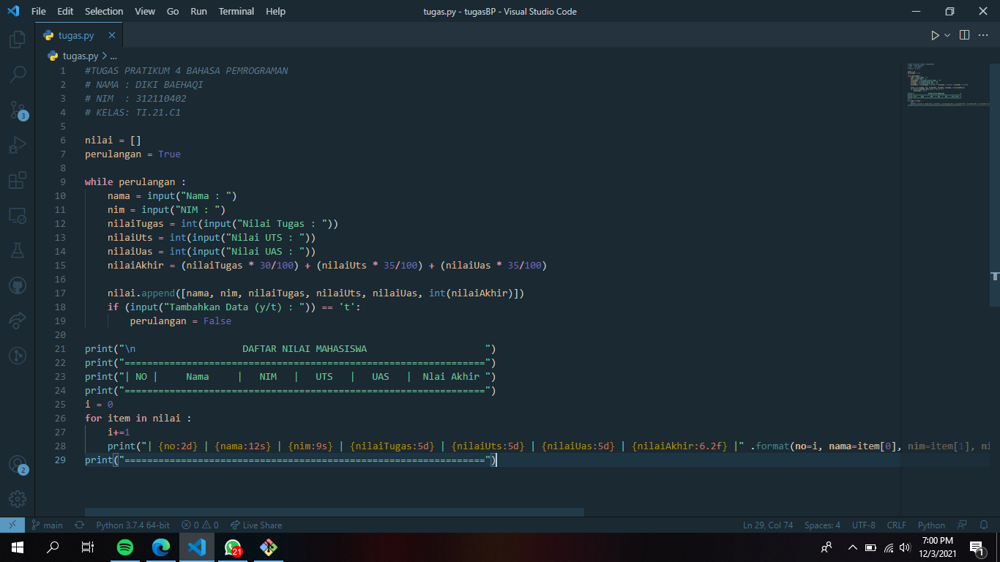
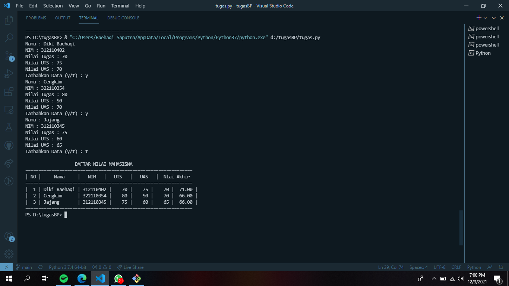

# pratikum4

## Input data mahasiswa menggunakan bahasa python

### flowchart dari input data mahasiswa
diagram alir/ flowchart untuk menginputkan data dan nilai mahasiswa

### latihan
 daftar program

### daftar program output

### input pada program ini
 Input nama • Input nim • Input nilai tugas • Input nilai uts • Input nilai uas • Masukan nilai akhir
 Selain itu saya menngunakan perintah while untuk mengulang pertanyaan yang akan di input
 maka outputnya akan ada pertanyaan tambah data jika jawab ‘Y’ pertanyaan akan terulang kembali dan di input kembali seperti sebelumnya, jika menjawab ‘T’ maka perintah selesai dan keluar output hasil inputan, dengan cara itu kita bisa menginput lebih dari 1 atau lebih sesuai yang kita inginkan.

### output program data mahasiswa
tampilan setelah di RUN

TERIMAKASIH

